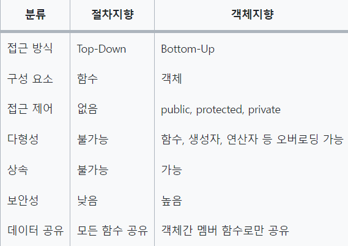

# OOP

## 1. OOP란

- OOP - Object-Oriented Programming
- 객체가 프로그램 동작의 주체, 객체는 실체 혹은 무형의 개념
- 상태와 동작이 존재함

| 객체 | 클래스 |
| --- | --- |
| 상태 | 멤버 변수 |
| 동작 | 메소 |
- JAVA에서 객체를 사용하기 위해 새로운 인스턴스를 생성 → 메모리를 할당하는 것이다.
- 장점: 코드의 재사용성, 유지보수 편함, 큰 프로젝트에 유리
- 단점: 느림, 높은 난이도, 잠재적인 복잡

## 2. Procedural Programming (절차 지향)

- 명령어들의 목록을 순서대로, 절차대로 처리하고 입력에 대한 결과를 처리하는 방식 → 절차 지향
- 장점: 빠름, 프로젝트 전체가 유기적으로 연결, 컴퓨터 처리 방식과 유
- 단점: 유지 보수가 어렵고 가독성이 낮아 대형 프로젝트에 부적합
- 정해진 순서대로 코드를 짜야함 → 순서가 바뀌면 다른 결과값 도출 됨

## 3. 객체 지향 vs 절차 지향



## 4. OOP의 4가지 특징

1) 캡슐화

- 캡슐화란 데이터와 코드의 형태를 외부로부터 보이지 않게 하고 데이터의 구조와 역할, 기능을 캡슐 형태로 만들어 정보 은닉하는 것
- 멤버 변수 앞에 접근 제어자 private을 붙여 클래스 내에서만 접근 가능하게 한다.
- 외부에서 값 변경시 시 setter/getter 메소드로만 접근 가능하게 한다.

2) 추상화

- 추상화란 복잡한 자료, 모듈, 시스템 등에서 핵심적이고 공통적인 개념, 기능을 간추려 내는 것
- 인터페이스, 추상 클래스 등으로 공통적인 특성(변수, 메소드)들을 묶어 표현하는 것

3) 상속

- 부모 클래스에 정의된 변수 및 메소드를 자식 클래스에서 상속받아 사용한다.

4) 다형성

- 하나의 객체가 여러 자료형 타입을 가질 수 있는 것
- 업캐스팅 : 자식클래스→부모 클래스 타입으로 변환
- 다운캐스팅 : 부모클래스→자식클래스로 타입 변환(명시적 타입 변환)

```java
	부모 parent1 = new 자식();  // 업캐스팅
	(자식)parent1.method();  //다운캐스팅

	double a = 1.2345;
	int b = 10
	double c = a + b;    // 캐스팅 -> b가 double 형으로 캐스팅
```

- 메소드 다형성- 같은 이름의 메소드가 다른 클래스에 대해 다른 동작을 하는
- 오버로딩 : 같은 이름의 메소드가 여러개, 파라미터 타입과 개수가 다름(리턴만 다르면 안됨!)
- 오버라이딩: 자식클래스가 상속받은 메소드를 재정의해서 사용하는 것, 런타임시 일어나는 동적 다형성
- instanceof 연산자 : 참조변수가 참조하고 있는 인스턴스의 실제 타입을 알아내는데 사용

## 5. OOP의 5가지 원칙 (SOLID)

- 상세 내용은 ([https://hckcksrl.medium.com/solid-원칙-182f04d0d2b](https://hckcksrl.medium.com/solid-%EC%9B%90%EC%B9%99-182f04d0d2b)) 참고
- S: (SRP : Single Responsibility Principle)
    - 한 클래스는 하나의 책임만 가져야 한다.
- O: (OCP : Open/Closed Principle)
    - 확장에는 열려(Open) 있으나, 변경에는 닫혀(Closed)있어야 한다.
- L: (LSP : Liskov’s Substitution Principle)
    - 프로그램의 객체는 프로그램의 정확성을 깨뜨리지 않으면서 하위 타입의 인스턴스로 바꿀 수 있어야 한다.
- I: (ISP : Interface Segregation Principle)
    - 특정 클라이언트를 위한 인터페이스 여러 개가 범용 인터페이스 하나보다 낫다.
- D: (DIP : Dependency Inversion Principle)
    - 추상화에 의존한다. 구체화에 의존하면 안된다.
